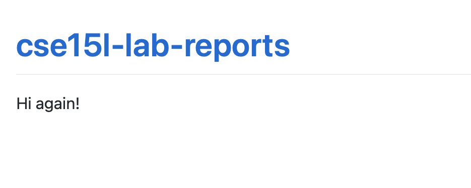

*Hello world :) in italics*
**Hi in BOLD**
# This is Heading One 1
## This is Heading Two 2
This is a link [Link] (https://commonmark.org/help/)
This is an image 
> Whoa this is a blockquote
* listing things
* like
* this
1. Or a numbered list
2. like
3. this
We can also do horizontal rule
---
`This is inline code with backticks` cool right?
```
NOW a whole
code block
omg
```

