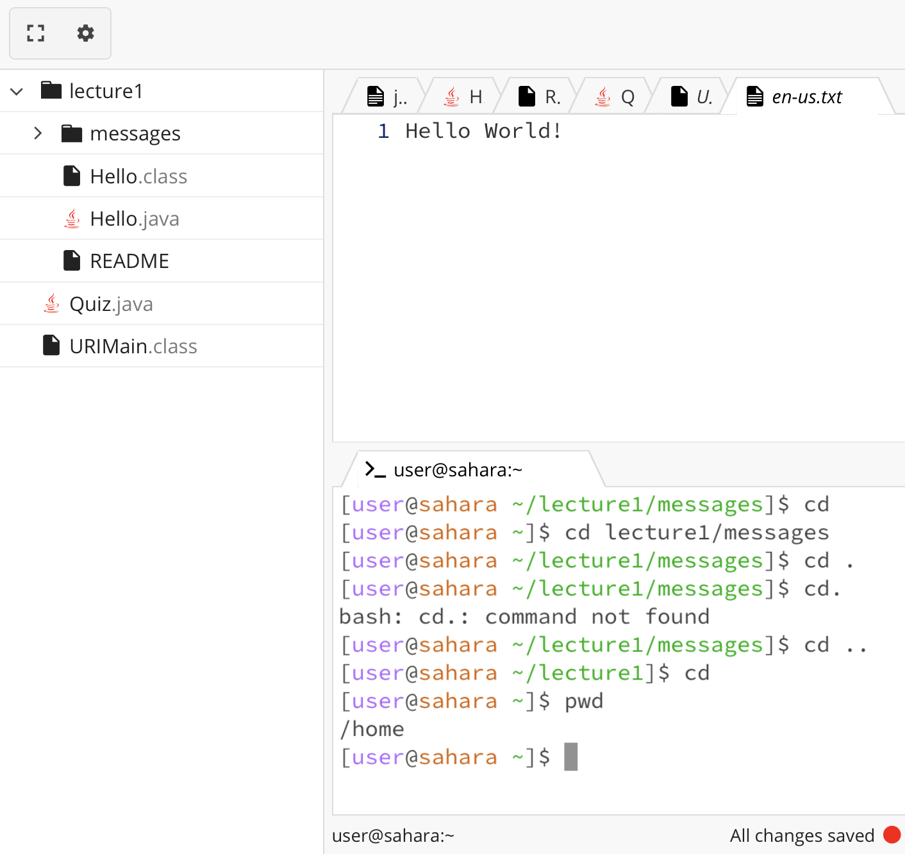
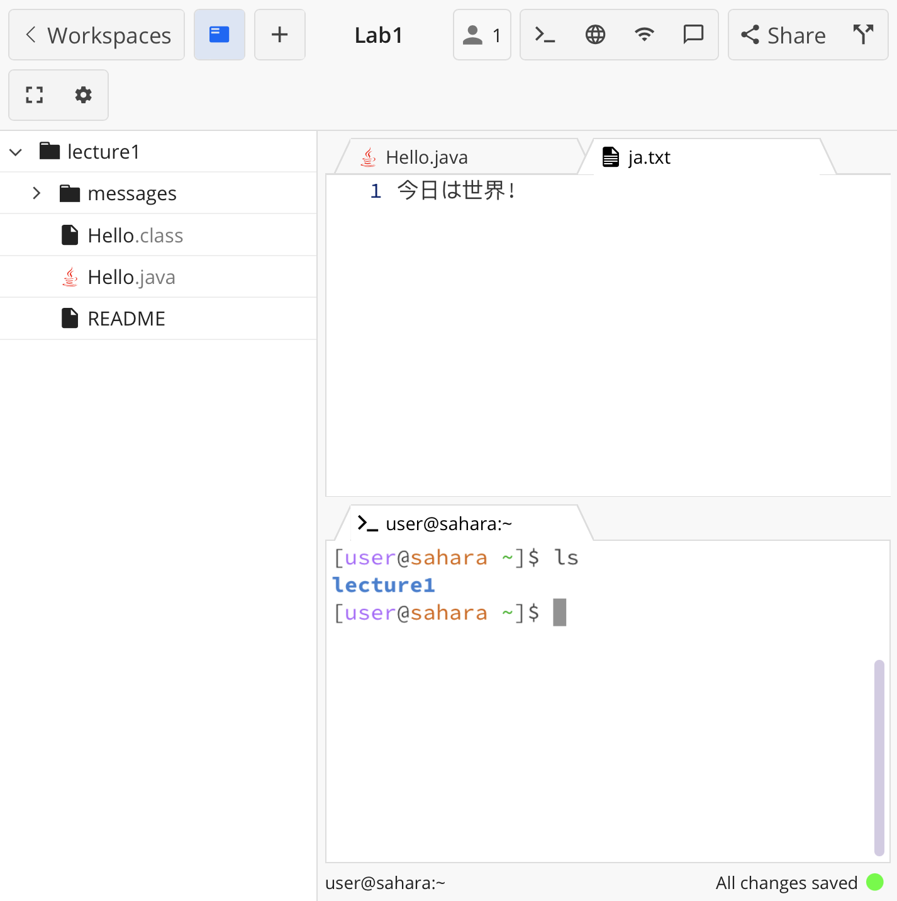
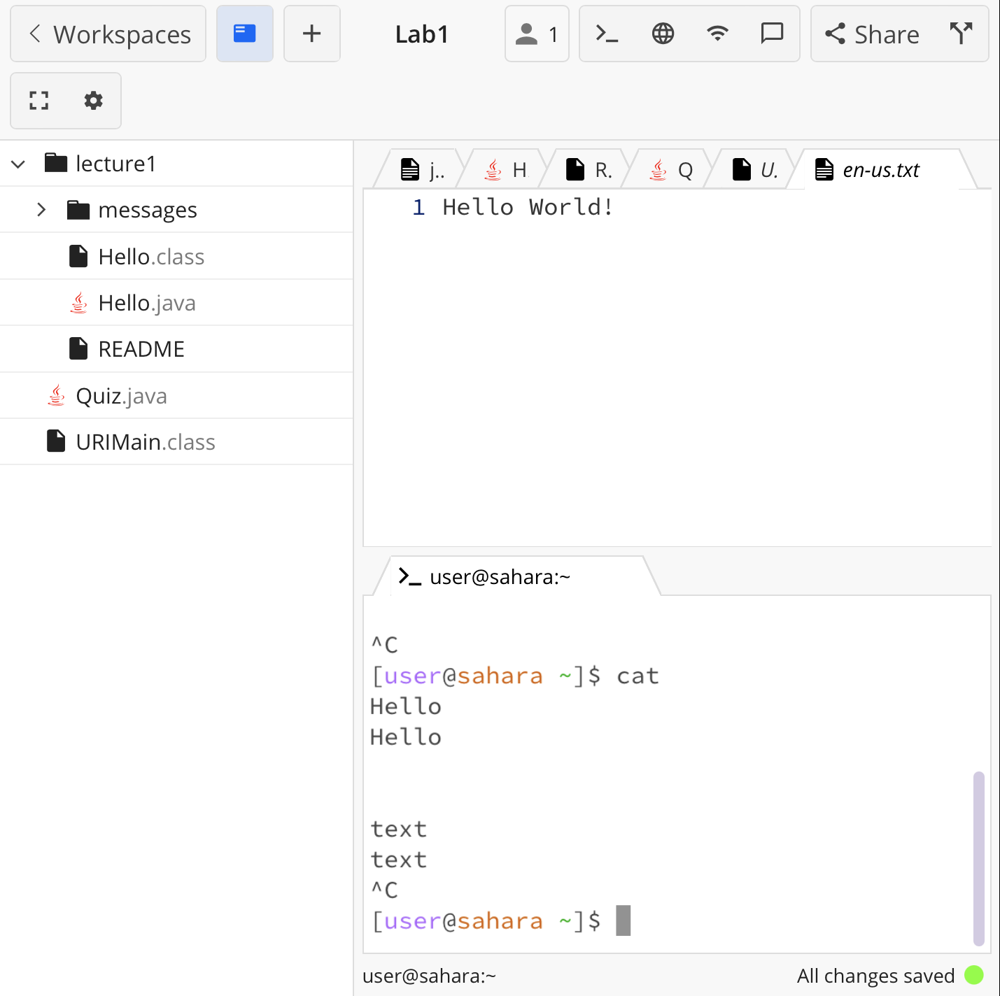
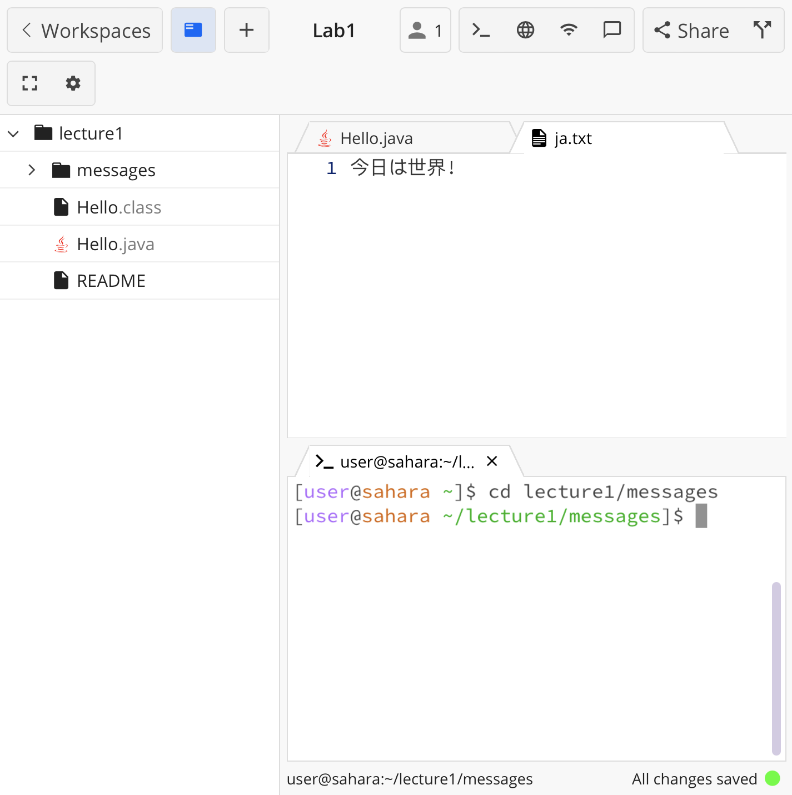
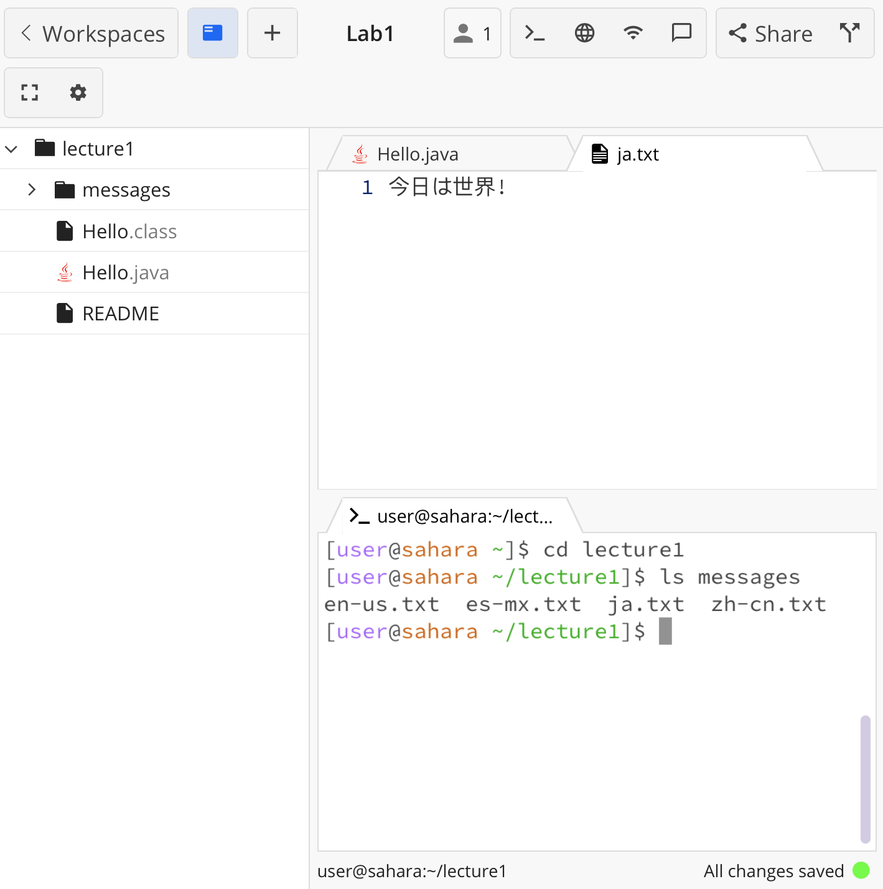
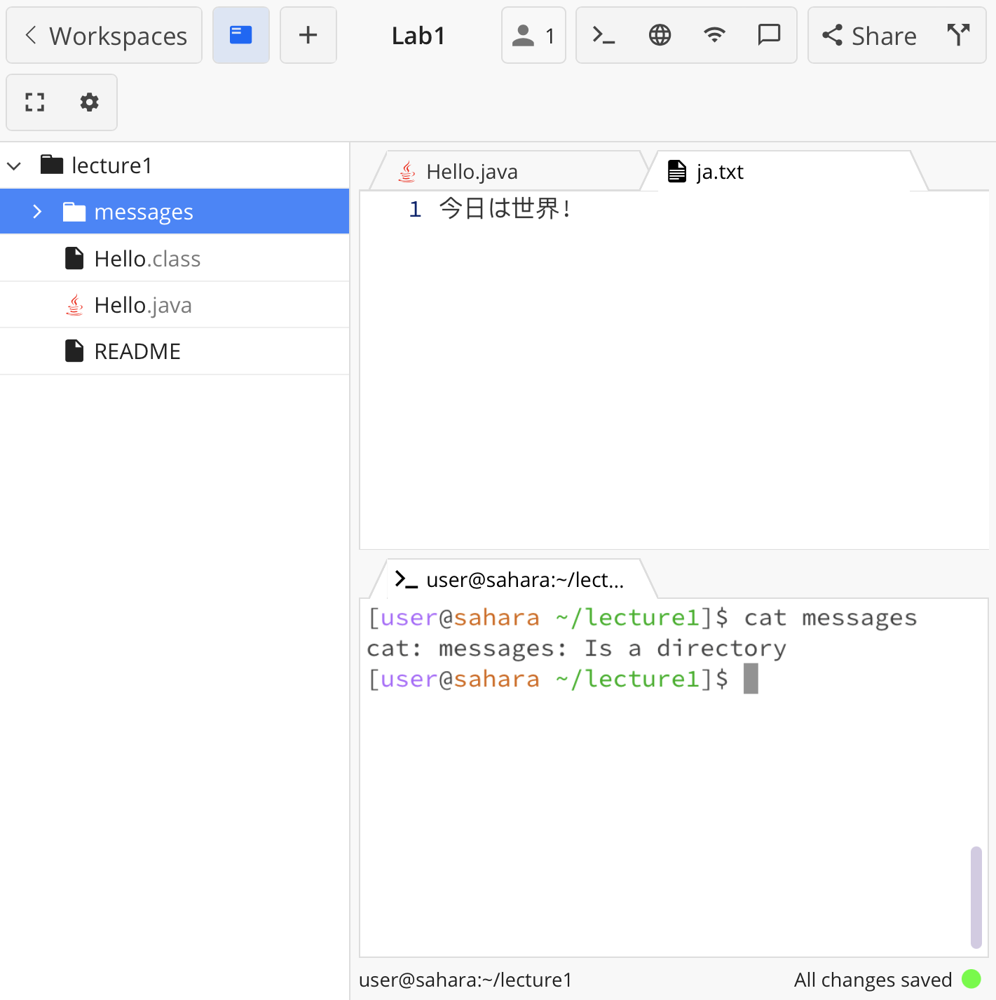
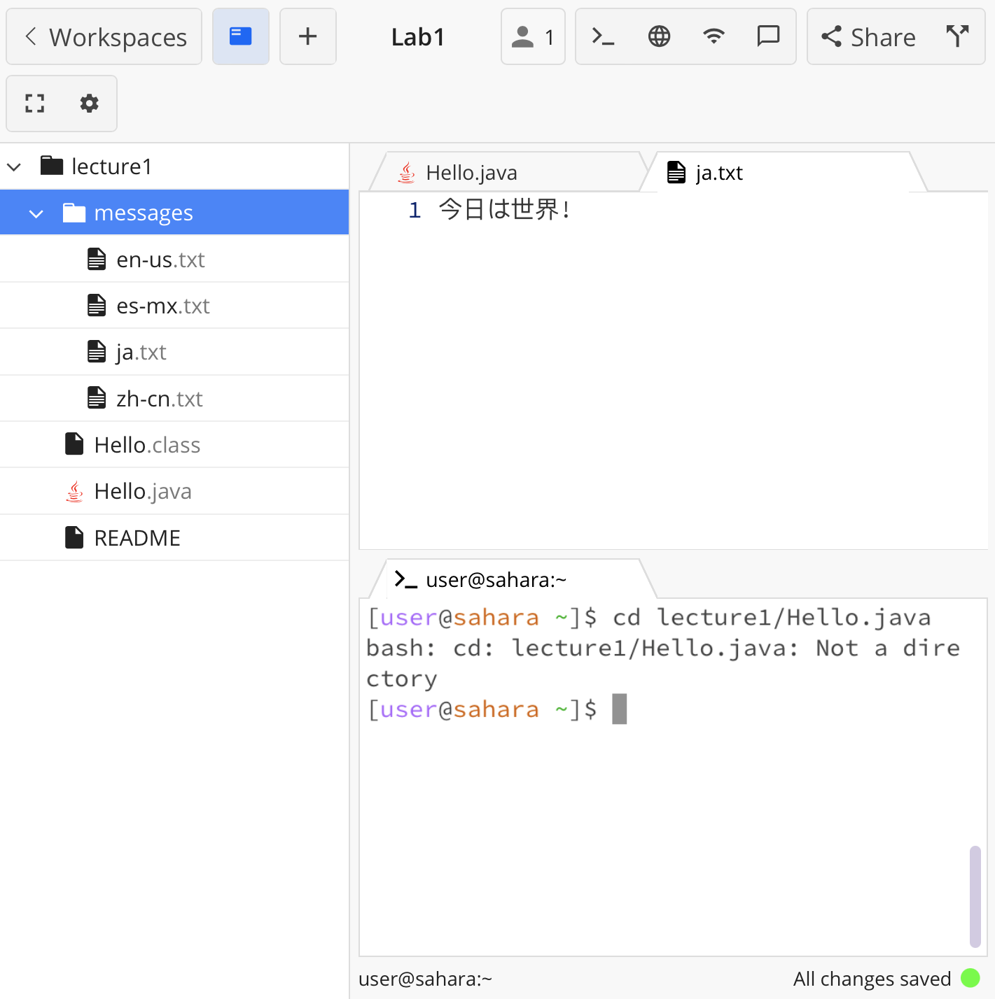
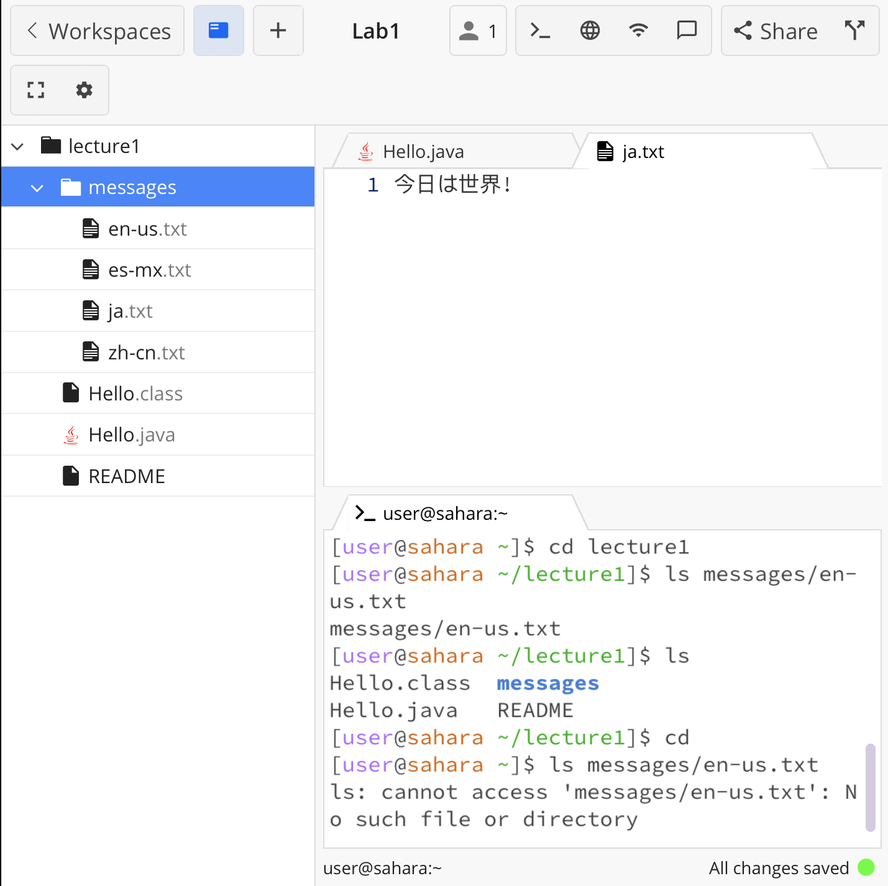
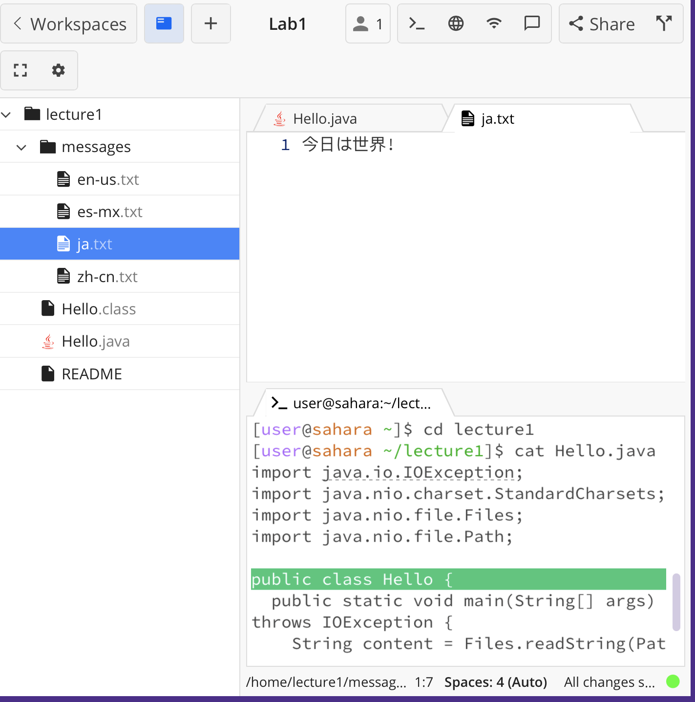

# Lab Report 1

## Commands with *no* arguments

**`cd`**

* Working directory: `/home/lecture1/messages`
* The command `cd` causes the terminal to change directories and go back to the root directory `/home`. When `cd ..` is used, the terminal goes out to the parent directory, which is `/home/lecture1`.
* This is not an error.

**`ls`**

* Working directory: `/home`
* The command prints out `lecture1` because `ls` functions to list out all files and folders in a directory. It assumes that the argument is the current working directory, so it only prints out 1 folder, which is directy under `/home` in the filesystem.
* This is not an error.

**`cat`**

* Working directory: `/home`
* The command changes the terminal to be in standard text and allows the terminal to copy and print out user input after the user presses `Enter`. Since there is no file argument, `cat` assumes that it should print input directly from the terminal. In order to end command execution, the user must use `Ctrl + C`.
* This is not an error.

## Commands with a path to a *directory* as an argument

**`cd lecture1/messages`**

* Working directory: `/home`
* The current working directory changes to `/home/lecture1/messages` because `cd` follows the relative path given when both `/home/lecture1` and `/home/lecture1/messages` are folders, and `/home/lecture1/messages` is listed under `/home/lecture1` in the filesystem.
* This is not an error.

**`ls messages`**

* Working directory: `/home/lecture1`
* The command prints out `en-us.txt  es-mx.txt  ja.txt  zh-cn.txt`, because they are all the files under the `/home/lecture1/messages` folder in the filesystem. 
* This is not an error.

**`cat messages`**

* Working directory: `/home/lecture1`
* The command prints out the output that `/home/lecture1/messages` is a directory, meaning that we need to use a file after `cat` to print out a file's contents.
* This is an error because `cat` cannot read the contents of a folder since a folder has no text or code content. It only contains other files in the filesystem.

## Commands with a path to a *file* as an argument

**`cd lecture1/Hello.java`**

* Working directory: `/home`
* The command prints out that `Hello.java` is not a directory because `Hello.java` is listed as a file under `/home/lecture1`.
* This is an error because `cd` was used on a file, not a folder, and the command can only be used to change between folders.

**`ls messages/en-us.txt`**

* Working directory: `/home/lecture1`
* The terminal prints out only `messages/en-us.txt` because the only file listed under `en-us.txt` is itself in the filesystem.
* This is not an error.

**`cat Hello.java`**

* Working directory: `/home/lecture1`
* The command prints out all the code in the `Hello.java` file because its function is to show the contents of a file on the terminal.
* This is not an error.
