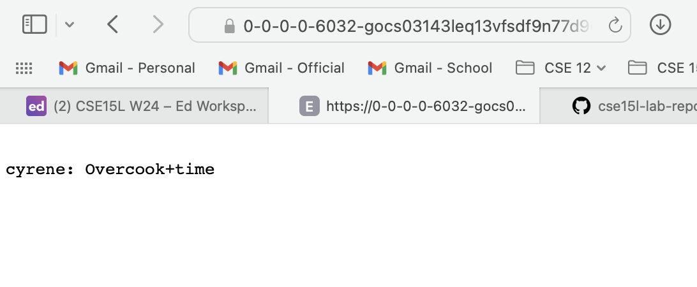
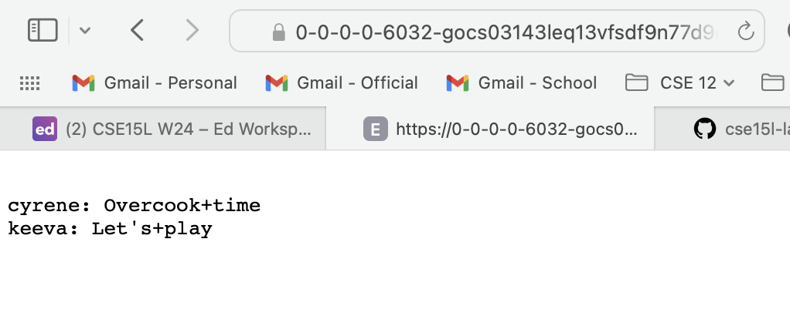
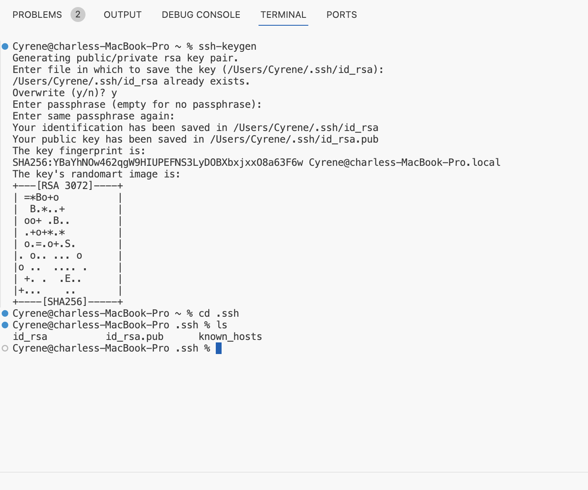
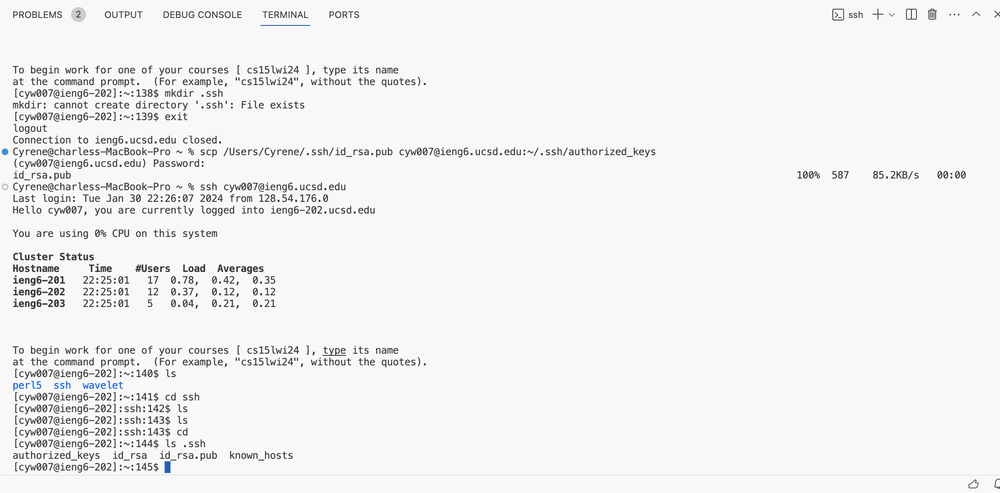
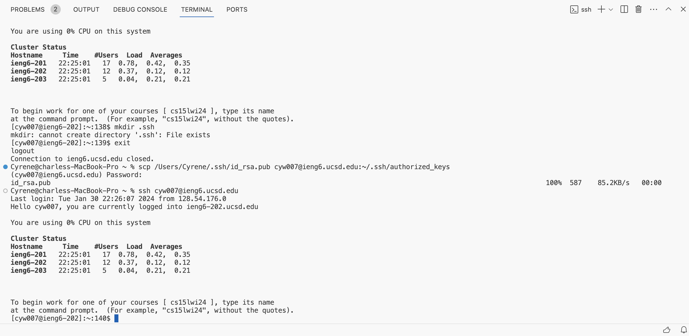

# Lab Report 2: Servers and SSH Keys

## Part 1
**`ChatServer.java` code**
```
import java.io.IOException;
import java.net.URI;

class Handler implements URLHandler {
    // The one bit of state on the server: a number that will be manipulated by
    // various requests.
    String concatenated = "";
    String user = "";
    String message = "";

    public String handleRequest(URI url) {
        if (url.getPath().equals("/")) {
            return String.format(concatenated);
        }
        else if (url.getPath().contains("/add-message")) {
            String[] parameters = url.getQuery().split("&");
            int i = 0;
            while (i < 2) {
                String[] request = parameters[i].split("=");
                if (request[0].equals("user")) {
                    user = request[1];
                }
                else if (request[0].equals("s")) {
                    message = request[1];
                }
                i++; 
            }
            concatenated = concatenated + "\n" + String.format("%s: %s", user, message);
            return concatenated;
        }
        else {
            return "404 Not Found!";
        }
        
    }
}

class ChatServer {
    public static void main(String[] args) throws IOException {
        if(args.length == 0){
            System.out.println("Missing port number! Try any number between 1024 to 49151");
            return;
        }

        int port = Integer.parseInt(args[0]);

        Server.start(port, new Handler());
    }
}
```

**Using `/add-message` Example 1**

* Methods called: The code calls the main method in the `ChatServer` class, which calls the `start` method from the `Server class` to instantiate a `Handler` object. In the `Handler` class, the  `handleRequest` method is called when a request is made.
* Relevant arguments for methods: The argument `args` in the `ChatServer` class holds an array of Strings with first element as `6032`. The argument `url` in the `Handler` class holds the URI from the web server.
* Values of relevant class fields: The field `port` in the `ChatServer` class holds the int 6032, from `args[0]`. The fields `concatenated`, 'user', and `message` in the `Handler` class hold empty Strings.
* Changes in values after request:\
    Using the path `/add-message?s=Overcook time&user=cyrene`, the field `parameters` holds an array of Strings after the `url`'s query is split at `"&"`. Specifically, the array holds `"s=Overcook"` at index 0 and `"user=cyrene"` at index 1.\
    In the while-loop, the field `request` holds an array of Strings from each element in `parameters` being split at `"="`.\
    During the first loop when i = 0, `request` stores `"s"` at index 0 and `"Overcook time"` at index 1. The field 'message' changes from an empty String and holds the String `"Overcook time"`.\
    During the second loop when i = 1, `request` stores `"user"` at index 0 and `"cyrene"` at index 1. The field 'user' changes from an empty String and holds the String `"cyrene"`.\
    The field `concatenated` changes from an empty String and holds the String `"cyrene: Overcook time"`.

**Using `/add-message` Example 2**

* Methods called: The code calls the main method in the `ChatServer` class, which calls the `start` method from the `Server class` to instantiate a `Handler` object. In the `Handler` class, the  `handleRequest` method is called when a request is made.
* Relevant arguments for methods: The argument `args` in the `ChatServer` class holds an array of Strings with first element as `6032`. The argument `url` in the `Handler` class holds the URI from the web server.
* Values of relevant class fields: The field `port` in the `ChatServer` class holds the int 6032, from `args[0]`. The field `concatenated` in the `Handler` class holds the String `"cyrene: Overcook time"`. The field 'user' in the `Handler` class holds the String `"cyrene"`. The field `message` in the `Handler` class holds the String `"Overcook time"`.
* Changes in values after request:
    Using the path `/add-message?s=Let's play&user=keeva`, the field `parameters` holds an array of Strings after the `url`'s query is split at `"&"`. Specifically, the array holds `"s=Let's play"` at index 0 and `"user=keeva"` at index 1.
    In the while-loop, the field `request` holds an array of Strings from each element in `parameters` being split at `"="`.
    During the first loop when i = 0, `request` stores `"s"` at index 0 and `"Let's play"` at index 1. The field 'message' changes from the String `"Overcook time"` and holds the String `"Let's play"`.
    During the second loop when i = 1, `request` stores `"user"` at index 0 and `"keeva"` at index 1. The field 'user' changes from the String `"cyrene"` and holds the String `"keeva"`.
    The field `concatenated` changes from the String `"cyrene: Overcook time"` and holds the String `"cyrene: Overcook time" + "\n" + "keeva: Let's play"`.

## Part 2

**Absolute path to the *private key* for SSH key**


**Absolute path to the *public key* for SSH key**


**Terminal interaction with no password for `ieng6` account**


## Part 3

**What I learned from Week 2-3 Labs**
