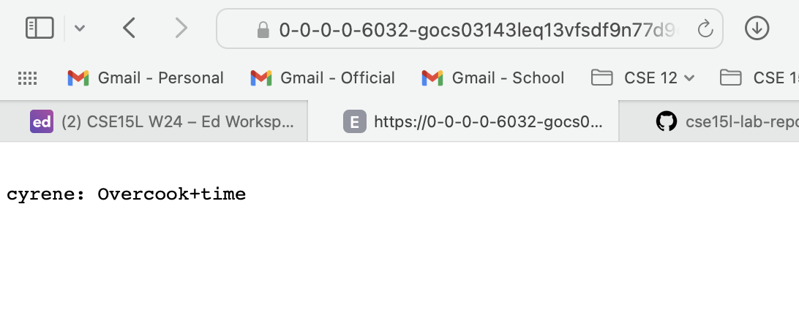

# Lab Report 3: Bugs and Commands

## Part 1: Bugs

**Using `/add-message` Example 1**



**Using `/add-message` Example 2**


## Part 2: Researching Commands

### `find`: 4 coommand-line options used on files and directories from `./technical`
**Using `find -`**
Example 1 command and output
```

```
*What it's doing and why it's useful:
**Using `find -`**
Example 2 command and output
```

```
*What it's doing and why it's useful:
**Using `find -`**
Example 3 command and output
```

```
*What it's doing and why it's useful:
**Using `find -`**
Example 4 command and output
```

```
*What it's doing and why it's useful:

Source:
