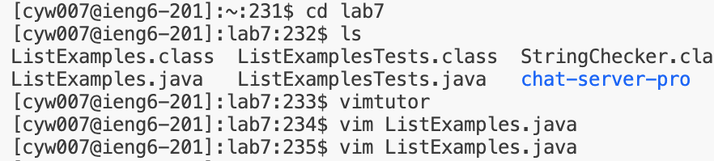
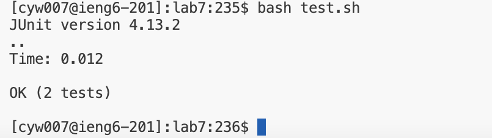
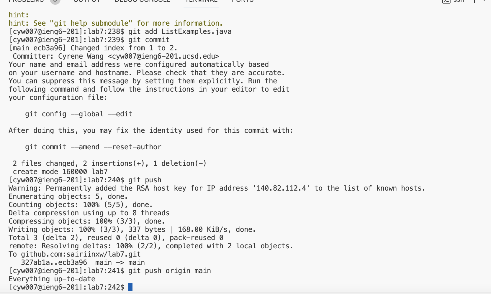

# Lab Report 4: Vim

### Log into ieng6

*Keys pressed: `<Ctrl-R> ssh cy<Enter>` -> `ssh cyw007@ieng6.ucsd.edu`
\
*The `<Ctrl-R>` command searches through my command history, so I typed in `ssh cy` to access the `ssh cyw007@ieng6.ucsd.edu` command. Then, I pressed `<Enter>` to run it and log into an ieng6 machine.

### Clone your fork of the repository from your Github account (using the SSH URL)

*Keys pressed: `<Ctrl-R> clone <Enter>` -> `git clone git@github.com:sairiinxw/lab7.git`
\
*The `<Ctrl-R>` command searches through my command history, so I typed in `clone` to find the specific git command: `git clone git@github.com:sairiinxw/lab7.git` command. Then, I pressed `<Enter>` to run it and clone my fork of the lab7 repository.

### Run the tests, demonstrating that they fail

*Keys pressed: `cd lab7`, `bash test.sh`
\
*The `cd lab7` command changes the working directory from `/home/linux/ieng6/oce/27/727/cyw007` to `/home/linux/ieng6/oce/27/727/cyw007/lab7`. The `bash test.sh` command runs the `test.sh` file, which contains JUnit commands for compiling files and running them.

### Edit the code file to fix the failing test

*Keys pressed: `vim ListExamples.java`, `44j 12l x i 2 <Esc> :wq`
\
*The `vim ListExamples.java` command opens up the vim text editor, which I used to delete 1 using `x` and append 2 to line 44 column 12 using `i 2`. I saved my changes using `:wq`.

### Run the tests, demonstrating that they now succeed

*Keys pressed: `<up><up><enter>` -> `bash test.sh`
\
*I use `<up><up><enter>` to access my last `bash test.sh` command, which runs the `test.sh` file with JUnit test. My tests pass after editing with vim.

### Commit and push the resulting change to your Github account (you can pick any commit message!)

*Keys pressed: `git add ListExamples.java`,`git commit`, `git push`
\
*I used 'git add' to update my `ListExamples.java` file. Then, I used `git commit` to add a commit message and commit my changes. Finally, I used `git push` to push it to my repository and made sure everything was up to date.

