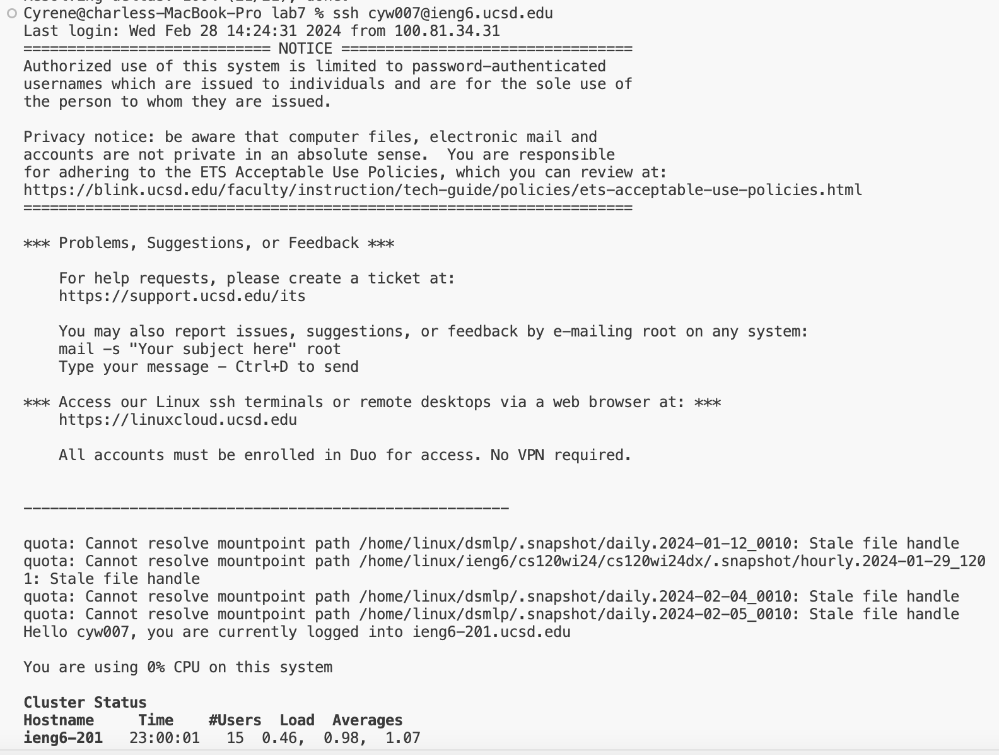
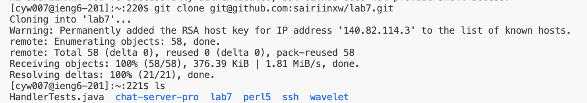
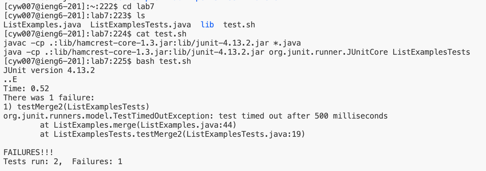

# Lab Report 4: Vim

### Log into ieng6

*Keys pressed: `<Ctrl-R> ssh cy<Enter>` -> 'ssh cyw007@ieng6.ucsd.edu'
*The `<Ctrl-R>` command searches through my command history, so I typed in `ssh cy` to access the `ssh cyw007@ieng6.ucsd.edu` command. Then, I pressed `<Enter>` to run it and log into an ieng6 machine.

### Clone your fork of the repository from your Github account (using the SSH URL)

*Keys pressed: '<Ctrl-R> clone <Enter>' -> 'git clone git@github.com:sairiinxw/lab7.git'
*The `<Ctrl-R>` command searches through my command history, so I typed in `clone` to find the specific git command: 'git clone git@github.com:sairiinxw/lab7.git' command. Then, I pressed `<Enter>` to run it and clone my fork of the lab7 repository.

### Run the tests, demonstrating that they fail

*Keys pressed: `cd lab7`, `bash test.sh`
*The `cd lab7` command changes the working directory from `/home/linux/ieng6/oce/27/727/cyw007` to `/home/linux/ieng6/oce/27/727/cyw007/lab7`. The `bash test.sh` command runs the `test.sh` file, which contains JUnit commands for compiling files and running them.

### Edit the code file to fix the failing test*Keys pressed: <up><up><up><up><enter>, <up><up><up><up><enter>
*The javac -cp .:lib/hamcrest-core-1.3.jar:lib/junit-4.13.2.jar *.java command was 4 up in the search history, so I used up arrow to access it. Then the java -cp .:lib/hamcrest-core-1.3.jar:lib/junit-4.13.2.jar org.junit.runner.JUnitCore ... command was 4 up in the history, so I accessed and ran it in the same way.

### Run the tests, demonstrating that they now succeed*Keys pressed: <up><up><up><up><enter>, <up><up><up><up><enter>
*The javac -cp .:lib/hamcrest-core-1.3.jar:lib/junit-4.13.2.jar *.java command was 4 up in the search history, so I used up arrow to access it. Then the java -cp .:lib/hamcrest-core-1.3.jar:lib/junit-4.13.2.jar org.junit.runner.JUnitCore ... command was 4 up in the history, so I accessed and ran it in the same way.

### Commit and push the resulting change to your Github account (you can pick any commit message!)*Keys pressed: <up><up><up><up><enter>, <up><up><up><up><enter>
*The javac -cp .:lib/hamcrest-core-1.3.jar:lib/junit-4.13.2.jar *.java command was 4 up in the search history, so I used up arrow to access it. Then the java -cp .:lib/hamcrest-core-1.3.jar:lib/junit-4.13.2.jar org.junit.runner.JUnitCore ... command was 4 up in the history, so I accessed and ran it in the same way.

