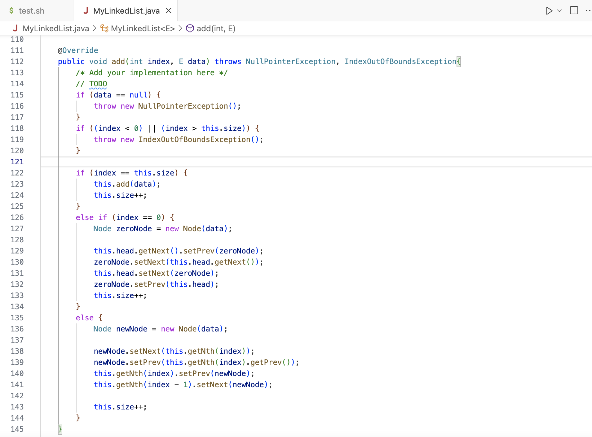
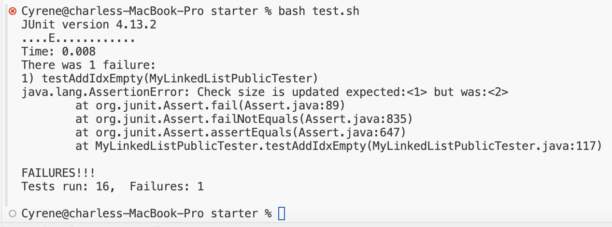
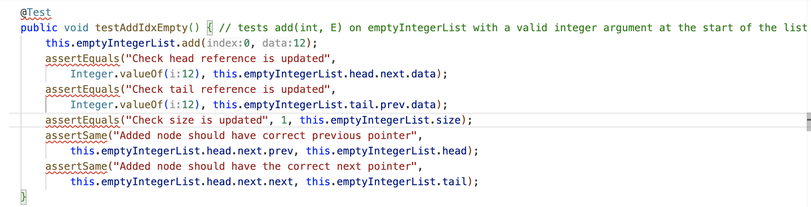
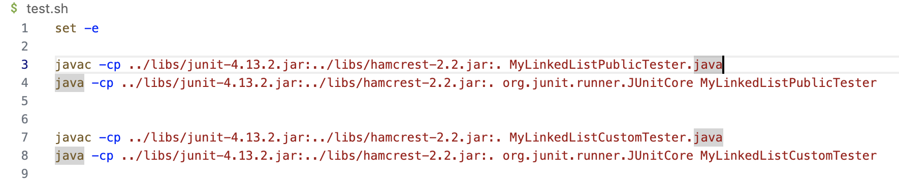
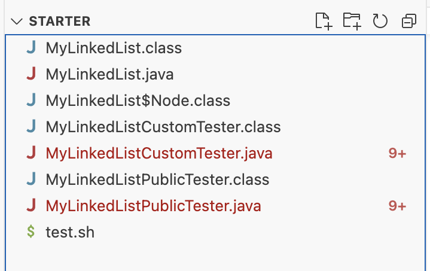
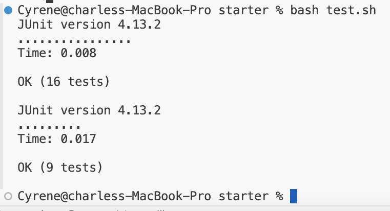
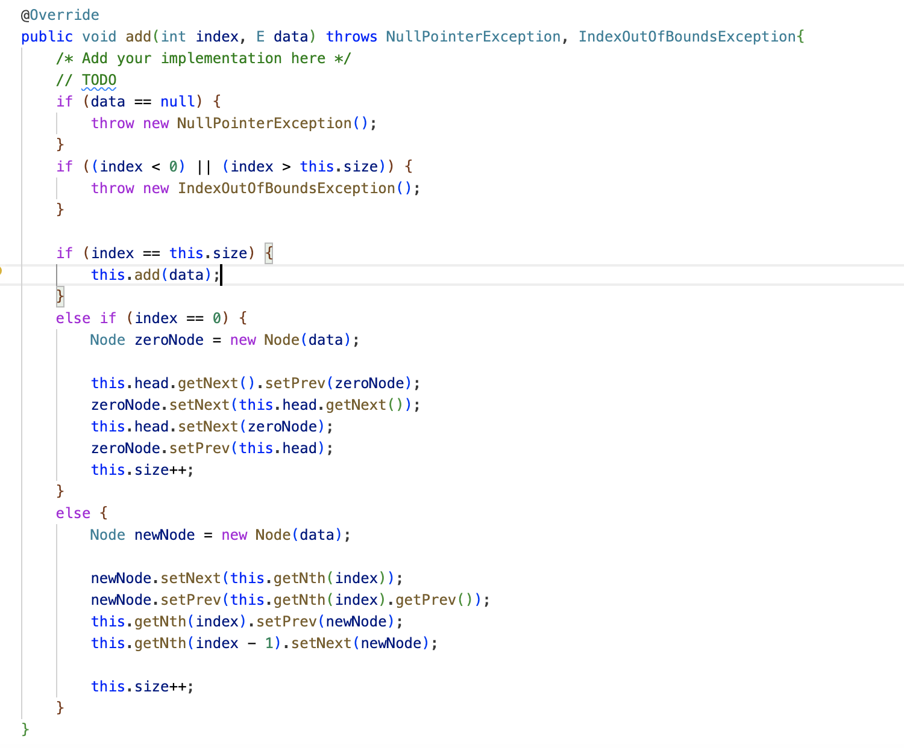
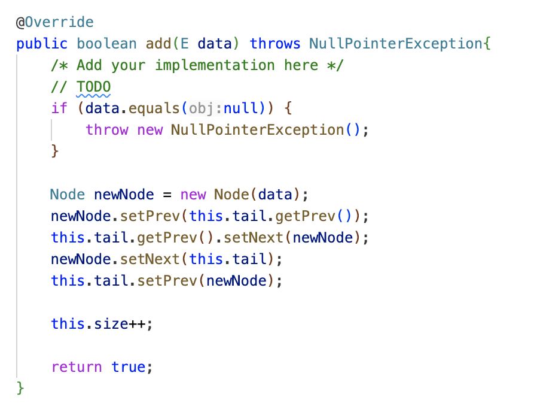

# Lab Report 3: Bugs and Commands

## Part 1: Debugging Scenario
### Screenshot showing a symptom and a description of a guess of what the failure-inducing input is
Hello, I am trying to test my implementation of a linked list, but one of my tests is failing for the `add(int index, E data)` method. The symptom is that the size increments twice, instead of once. The failure-inducing input is when I use the `add` method with index 0 and data 12 to an empty list. Can I get some help debugging my code?

\
This is my test output in my terminal.

\
This is my implementation for the test case.

\
My `test.sh` contains the Junit commands, which I ran using `bash test.sh`.

\
This is my file directory structure.

### Response from a TA asking a leading question or suggesting a command to try
Since both your index and your empty list size is 0, your code will run line 122 `if (index == this.size)`. Try working through the method in line 123 `this.add(data);` to see what it's doing with your list size.

### Screenshot/terminal output showing information from trying that and a clear description of the bug
Thank you so much! I worked through the `add(E data)` method and found what caused the bug in my code.

\
I found out that I did not need to increment the size inside the if statement of `add(int index, E data)` because `add(E data)` already increments it for me. I deleted line 124 `this.size++;` and passed all my tests.

## Part 2: Reflection
*The most useful topic I learned from my lab experience during the second half of this quarter was how to use a script and take advantage of different commands to explore files and analyze specific text. Writing bash scripts helped me save a lot of time on my programming assignments for CSE 12 during testing, and the commands enabled me to get more information out of my code than I knew how to before. It was also fun to use vim to edit text in VSCode. 
**Sources**
[Red Hat] (https://www.redhat.com/sysadmin/linux-find-command)
[IBM] (https://www.ibm.com/docs/pl/aix/7.1?topic=f-find-command)
